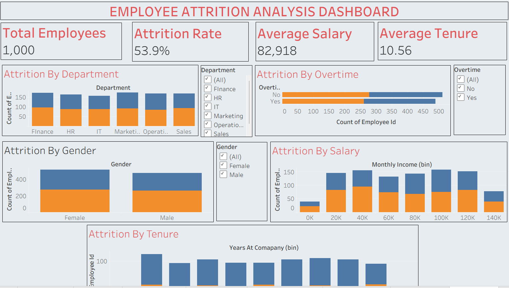

# Employee-Attrition-Analysis-Dashboard
Interactive Tableau dashboard analyzing employee attrition using an HR dataset. The project explores attrition trends across department, salary, overtime, gender, and tenure to identify key factors influencing employee turnover.
# Project Overview
Employees churn is a significant concern for businesses since recruiting and training new employees can be costly and disruptive. This project analyses the HR data to figure our the employee turnover patterns. Usinf Tableau dashboard the analysis explores trends across department, salary, overtime, gender, and tenure to provide insights that can help improve employee retention strategies.
# Project Objectives
To analyze overall employee attrition patterns within the organization.
To identify departments and employee groups with higher turnover rates.
To examine how factors such as salary, overtime, gender, and tenure influence attrition.
To present insights through an interactive Tableau dashboard for easier understanding and decision-making.
# Tools used
Mockaroo - For generating the data
Excel - Dataset storage and preparation
Tableau Public - For Dashboard creation
# Dataset
The dataset contains customised HR data using Mockaroo website with 1000 rows.
Columns include:
EmployeeID
Department
JobRole
Gender
EducationLevel
MaritalStatus
MonthlyIncome
YearsAtCompany
Overtime
Attrition
# Key Dashboard Insights
KPI's (Key Performance Indicators)
Total Employees = 1000
Attrition Rate = 53.9%
Average Salary = 82,918
Average Tenure = 10.56 years
Attrition By Gender: Male = 263
                     Female = 276
More Females are tend to leave than males.
Attrition by Department: 
Finance, Marketing, Sales departments show higher attrition rate than others, showing potential management or workload issues.
Attrition by Tenure
Employees with shorter tenure tend to leave more frequently, which may indicate onboarding or early career dissatisfaction.
#Conclusion
From the dashboard we can figure out the reason for the high attrition rate, because of the workload, low salary and tenure.
This project highlights the value of using data-driven insights to support HR decision-making.
## Dashboard Preview

,[Dashboard2](HRAttritionDashboard2.png)

#Author
Penumati Hiranya
MBA(Finance, Business Analytics)
